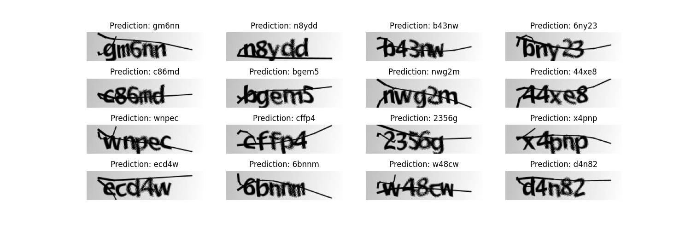

## OCR model for reading Captchas

**Introduction**

This example demonstrates a simple OCR model built
with the Functional API. Apart from combining CNN
and RNN, it also illustrates how you can instantiate
a new layer and use it as an "Endpoint layer" for
implementing CTC loss. 

**Train and Inference:**

Unzip the file `captcha_images_v2.zip`

    python main.py

**Result**

**Reference**
1. https://keras.io/examples/vision/captcha_ocr/